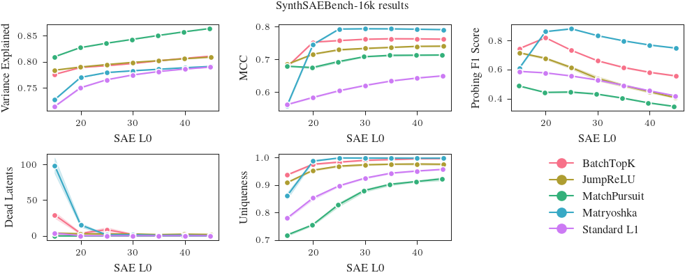

# SynthSAEBench

Evaluating SAE architectures is difficult. When we train an SAE on an LLM, we don't know the ground-truth features of the LLM, so it's difficult to tell if the SAE is finding the correct features, and we cannot easily debug why things are not working. SynthSAEBench provides tools for large-scale synthetic models with realistic properties with ground-truth features, enabling precise evaluation of SAE quality. SynthSAEBench is not a replacement for LLM SAE benchmarks like [SAEBench](https://github.com/adamkarvonen/SAEBench), but is instead a tool for developing, evaluating, and debugging SAE architectures in ways that LLM SAE benchmarks cannot replicate.

We use the name "SynthSAEBench" to refer to the synthetic data generation and evaluation tools, and "SynthSAEBench-16k" to refer to our default standardized benchmark model. You can create your own synthetic data models as well with our tools to test out how your SAE architectures perform with different levels of superposition, hierarchy, correlations, and more.

For a hands-on walkthrough, see the [tutorial notebook](https://github.com/decoderesearch/SAELens/blob/main/tutorials/synth_sae_bench.ipynb)
[](https://githubtocolab.com/decoderesearch/SAELens/blob/main/tutorials/synth_sae_bench.ipynb).

For the full synthetic data API reference, see [Synthetic Data](synthetic_data.md). Also see the [SynthSAEBench paper](https://arxiv.org/abs/2602.14687) for more details on the synthetic data primitives and the benchmark results.

## SynthSAEBench-16k Model

The SynthSAEBench-16k model is our standardized benchmark model.

**Configuration:**

| Parameter | Value |
|-----------|-------|
| Ground-truth features | 16,384 |
| Hidden dimension | 768 |
| Firing distribution | Zipfian (exponent=0.5, p_max=0.4, p_min=5e-4) |
| Average L0 | ~34 active features per sample |
| Hierarchy | 128 root nodes, branching factor 4, max depth 3 |
| Mutual exclusion | All hierarchical children are mutually exclusive |
| Correlations | Low-rank (rank=25, scale=0.1) |
| Orthogonalization | 100 steps, lr=3e-4 |
| Mean magnitudes | Linear from 5.0 (frequent) to 4.0 (rare) |
| Std magnitudes | Folded normal (mean=0.5, std=0.5) |

**Loading from HuggingFace:**

```python
from sae_lens.synthetic import SyntheticModel

model = SyntheticModel.from_pretrained(
    "decoderesearch/synth-sae-bench-16k-v1", device="cuda"
)
```

## Quickstart: Training an SAE on SynthSAEBench-16k

We recommend training SAEs with **width 4096** on SynthSAEBench-16k, as in reality we expect most SAEs to be trained at a narrower width than the underlying number of "true features" of an LLM. For our benchmarking, we use 200M samples with LR of 3e-4, and batch size of 1024. An example BatchTopK SAE training run matching these recommended settings is shown below:

```python
from sae_lens.synthetic import SyntheticSAERunner, SyntheticSAERunnerConfig
from sae_lens import BatchTopKTrainingSAEConfig, LoggingConfig

runner_cfg = SyntheticSAERunnerConfig(
    # Load the pretrained benchmark model
    synthetic_model="decoderesearch/synth-sae-bench-16k-v1",

    # Configure the SAE
    sae=BatchTopKTrainingSAEConfig(
        d_in=768,
        d_sae=4096,
        k=25,
    ),

    # Training parameters
    training_samples=200_000_000,
    batch_size=1024,
    lr=3e-4,
    device="cuda",

    # Output path
    output_path="output",

    # Evaluation
    eval_frequency=1000,  # Evaluate metrics every N steps
    eval_samples=500_000,

    # Performance (recommended for modern GPUs)
    autocast_sae=True,
    autocast_data=True,

    # Optional: Logging to Weights & Biases
    logger=LoggingConfig(
        log_to_wandb=True,
        wandb_project="my_project",
        wandb_entity="my_team",  # Optional
        run_name="my-run",       # Auto-generated if not set
        wandb_log_frequency=100,  # Log metrics every N training steps
    ),
)

runner = SyntheticSAERunner(runner_cfg)
result = runner.run()

# Evaluate with ground-truth metrics
print(f"MCC: {result.final_eval.mcc:.3f}")
print(f"Explained variance: {result.final_eval.explained_variance:.3f}")
print(f"Uniqueness: {result.final_eval.uniqueness:.3f}")
print(f"F1: {result.final_eval.classification.f1_score:.3f}")
print(f"Precision: {result.final_eval.classification.precision:.3f}")
print(f"Recall: {result.final_eval.classification.recall:.3f}")
print(f"L0: {result.final_eval.sae_l0:.1f}")
print(f"Dead latents: {result.final_eval.dead_latents}")
```

## Evaluation Metrics

All metrics are computed by [eval_sae_on_synthetic_data][sae_lens.synthetic.eval_sae_on_synthetic_data], which leverages ground-truth feature vectors and activations.

### Explained Variance (R²)

Fraction of input variance explained by the SAE reconstruction. Measures reconstruction quality independently of feature recovery. A value of 1.0 means perfect reconstruction.

### MCC (Mean Correlation Coefficient)

Uses the Hungarian algorithm to find the optimal one-to-one matching between SAE decoder columns and ground-truth feature vectors, then computes the mean absolute cosine similarity. Range [0, 1] where 1 = perfect recovery of all features. See the paper [Compute Optimal Inference and Provable Amortisation Gap in Sparse Autoencoders](https://arxiv.org/abs/2411.13117) for more details.

### Feature Uniqueness

Fraction of SAE latents that track unique ground-truth features. If multiple latents map to the same ground-truth feature, uniqueness decreases. A value of 1.0 means every active latent corresponds to a different ground-truth feature.

### Classification Metrics (Precision, Recall, F1)

Each SAE latent is treated as a binary classifier for its best-matching ground-truth feature:

- **Precision**: Of the samples where the latent fires, what fraction have the ground-truth feature active? High precision means few false positives.
- **Recall**: Of the samples where the ground-truth feature is active, what fraction does the latent fire for? High recall means few false negatives.
- **F1 Score**: Harmonic mean of precision and recall. Provides a single measure of per-latent detection quality.

### L0 and Dead Latents

- **L0**: Average number of active SAE latents per sample. Compare to the model's true L0 (~34 for SynthSAEBench-16k, or ~25 if we just consider the top 4096 highest-frequency features matching recommended SAE width).
- **Dead latents**: Number of SAE latents that never activate. High values indicate wasted capacity.

### Shrinkage

Ratio of SAE output norm to input norm. Values below 1.0 indicate the SAE is systematically shrinking reconstructions, which is a known issue with L1-penalized SAEs.


## Creating Custom Benchmark Models

You can create custom synthetic models for ablation studies or your own specialized benchmarks:

```python
from sae_lens.synthetic import (
    SyntheticModel,
    SyntheticModelConfig,
    SyntheticSAERunner,
    SyntheticSAERunnerConfig,
    ZipfianFiringProbabilityConfig,
    HierarchyConfig,
    OrthogonalizationConfig,
    LowRankCorrelationConfig,
    LinearMagnitudeConfig,
    FoldedNormalMagnitudeConfig,
)
from sae_lens import BatchTopKTrainingSAEConfig

# Example: vary the level of superposition
for hidden_dim in [256, 512, 768, 1024, 1536]:
    cfg = SyntheticModelConfig(
        num_features=16_384,
        hidden_dim=hidden_dim,
        firing_probability=ZipfianFiringProbabilityConfig(
            exponent=0.5,
            max_prob=0.4,
            min_prob=5e-4,
        ),
        hierarchy=HierarchyConfig(
            total_root_nodes=128,
            branching_factor=4,
            max_depth=3,
            mutually_exclusive_portion=1.0,
            compensate_probabilities=True,
            scale_children_by_parent=True,
        ),
        orthogonalization=OrthogonalizationConfig(num_steps=100, lr=3e-4),
        correlation=LowRankCorrelationConfig(rank=25, correlation_scale=0.1),
        mean_firing_magnitudes=LinearMagnitudeConfig(start=5.0, end=4.0),
        std_firing_magnitudes=FoldedNormalMagnitudeConfig(mean=0.5, std=0.5),
        seed=42,
    )
    
    runner_cfg = SyntheticSAERunnerConfig(
        synthetic_model=cfg,
        sae=BatchTopKTrainingSAEConfig(
            d_in=hidden_dim,
            d_sae=4096,
            k=25,
        ),
        training_samples=200_000_000,
        batch_size=1024,
        lr=3e-4,
        # ... other parameters skipped for brevity ...
    )
    results = SyntheticSAERunner(runner_cfg).run()
```

For the full API reference on all configuration options, see [Synthetic Data](synthetic_data.md).

## Benchmark Results

We have trained and evaluated a series of SAEs on SynthSAEBench-16k. The code for these experiments is at [https://github.com/decoderesearch/synth-sae-bench-experiments](https://github.com/decoderesearch/synth-sae-bench-experiments). Full results and SAEs are available at [https://huggingface.co/decoderesearch/synth-sae-bench-16k-v1-saes](https://huggingface.co/decoderesearch/synth-sae-bench-16k-v1-saes).



## Citation

If you use SynthSAEBench in your research, please cite:

```
@article{synthsaebench2026,
  title={SynthSAEBench: Evaluating Sparse Autoencoders on Scalable Realistic Synthetic Data},
  author={David Chanin and Adrià Garriga-Alonso},
  journal={arXiv preprint arXiv:2602.14687},
  year={2026}
}
```
